# 🤖 InvoiceGenius AI

**Transform your invoice processing workflow with enterprise-grade AI-powered automation**

[](https://python.org)
[](https://streamlit.io)
[](https://ai.google.dev)
[](LICENSE)
[](CONTRIBUTING.md)

> **Intelligent Multi-Language Invoice Processing & Analytics Platform** - From basic extraction to enterprise intelligence, we've got your invoices covered.

---

## 📋 Table of Contents

- [🌟 Overview](#-overview)
- [✨ Key Features](#-key-features)
- [🏗️ Architecture](#️-architecture)
- [🔄 Workflow](#-workflow)
- [🚀 Quick Start](#-quick-start)
- [📖 Detailed Usage Guide](#-detailed-usage-guide)
- [🔧 Configuration](#-configuration)
- [📊 Export & Analytics](#-export--analytics)
- [🛡️ Security & Validation](#️-security--validation)
- [🧩 API Reference](#-api-reference)
- [🔍 Troubleshooting](#-troubleshooting)
- [🤝 Contributing](#-contributing)
- [📄 License](#-license)

---

## 🌟 Overview

InvoiceGenius AI is a comprehensive, enterprise-grade invoice processing platform that transforms manual invoice handling into an automated, intelligent workflow. Built with cutting-edge AI technology, it provides accurate data extraction, real-time analytics, and seamless export capabilities.

### 🎯 What Makes It Special?

- **🧠 Context-Aware AI**: Uses Google Gemini's multimodal capabilities to understand invoice semantics, not just text
- **🌍 Multi-Language Support**: Processes invoices in 13+ languages automatically with intelligent detection
- **📊 Real-Time Analytics**: Transforms raw data into actionable business intelligence
- **🔒 Enterprise Security**: Multiple validation layers with comprehensive audit trails
- **⚡ Session Persistence**: Advanced session state management prevents data loss
- **📈 Scalable Architecture**: Handles single invoices to enterprise-level batch processing

---

## ✨ Key Features

### 🧠 Intelligent Processing Engine

```mermaid
graph TB
    A[📄 Invoice Upload] --> B{🔍 File Validation}
    B -->|Valid| C[🖼️ Image Processing]
    B -->|Invalid| D[❌ Rejection]
    C --> E[🤖 AI Analysis]
    E --> F[📊 Data Extraction]
    F --> G[✅ Validation]
    G --> H[💾 Storage]
    H --> I[📈 Analytics]
```


- **Multi-modal AI Processing**: Google Gemini 1.5 Pro/Flash integration
- **Confidence Scoring**: AI-driven quality assessment for each extraction
- **Business Rule Validation**: Automated verification of calculations and data consistency
- **Error Detection**: Intelligent flagging of inconsistencies and anomalies

### 🌍 Multi-Language & Multi-Currency
- **Automatic Language Detection**: No manual configuration required
- **13+ Supported Languages**: English, Spanish, French, German, Chinese, Japanese, Korean, Arabic, Hindi, Italian, Portuguese, Dutch, Russian
- **Currency Recognition**: Handles multiple currencies with conversion capabilities
- **Regional Format Support**: Adapts to different date and number formats

### 📊 Advanced Analytics & Business Intelligence

```mermaid
graph LR
    A[📄 Raw Invoice Data] --> B[📊 Analytics Engine]
    B --> C[📈 Trend Analysis]
    B --> D[🏢 Vendor Intelligence]
    B --> E[💰 Financial Insights]
    B --> F[⚠️ Anomaly Detection]
    C --> G[📋 Executive Reports]
    D --> G
    E --> G
    F --> G
```


- **Real-time Dashboard**: Key metrics and performance indicators
- **Trend Analysis**: Monthly patterns and growth tracking
- **Vendor Performance**: Supplier relationship optimization
- **Cash Flow Forecasting**: Predictive financial planning
- **Anomaly Detection**: Fraud prevention and quality assurance

### 🔒 Enterprise-Grade Security
- **Multi-layer File Validation**: Content analysis and malware detection
- **Input Sanitization**: XSS and injection attack prevention
- **Audit Trails**: Complete processing history for compliance
- **Data Encryption**: Secure storage and transmission
- **Access Control**: Role-based permissions (future enhancement)

---

## 🏗️ Architecture

### System Architecture Overview

```mermaid
graph TB
    subgraph "🌐 Frontend Layer"
        A[Streamlit Web UI]
        B[Session State Manager]
    end
    
    subgraph "🧠 Processing Layer"
        C[Invoice Processor]
        D[AI Engine - Google Gemini]
        E[Validation Engine]
        F[Analytics Engine]
    end
    
    subgraph "💾 Data Layer"
        G[SQLite Database]
        H[File System Storage]
        I[Export Manager]
    end
    
    subgraph "🔧 Infrastructure"
        J[Configuration Manager]
        K[Logging System]
        L[Error Handler]
    end
    
    A --> C
    B --> A
    C --> D
    C --> E
    E --> F
    F --> G
    C --> H
    F --> I
    J --> C
    K --> C
    L --> C
```


### Component Architecture

```mermaid
graph TD
    subgraph "📱 Application Core"
        A[InvoiceGeniusApp]
        B[Config Manager]
        C[Session State]
    end
    
    subgraph "🔄 Processing Pipeline"
        D[Input Validator]
        E[Invoice Processor]
        F[AI Integration]
        G[Data Normalizer]
    end
    
    subgraph "💾 Data Management"
        H[Database Manager]
        I[Export Manager]
        J[Analytics Engine]
    end
    
    subgraph "🎨 User Interface"
        K[Processing View]
        L[Analytics Dashboard]
        M[Export Center]
        N[Settings Panel]
    end
    
    A --> D
    A --> K
    D --> E
    E --> F
    F --> G
    G --> H
    H --> J
    J --> L
    H --> I
    I --> M
    B --> N
    C --> A
```


### Database Schema


---

## 🔄 Workflow

### Invoice Processing Workflow

```mermaid
sequenceDiagram
    participant U as 👤 User
    participant UI as 🖥️ Web Interface
    participant V as 🛡️ Validator
    participant P as 🤖 AI Processor
    participant DB as 💾 Database
    participant A as 📊 Analytics
    
    U->>UI: Upload Invoice(s)
    UI->>V: Validate Files
    V-->>UI: Validation Result
    
    alt Valid Files
        UI->>P: Process Invoice
        P->>P: Image Enhancement
        P->>P: AI Extraction
        P->>P: Data Normalization
        P->>P: Business Validation
        P-->>UI: Extraction Result
        UI->>DB: Store Results
        DB->>A: Update Analytics
        A-->>UI: Real-time Metrics
        UI-->>U: Show Results + Export Options
    else Invalid Files
        UI-->>U: Show Error Message
    end
```


### Export Workflow

```mermaid
graph LR
    A[📊 Processed Data] --> B{📝 Export Format}
    B -->|Excel| C[📄 Generate XLSX]
    B -->|CSV| D[📄 Generate CSV]
    B -->|JSON| E[📄 Generate JSON]
    B -->|PDF| F[📄 Generate PDF Report]
    
    C --> G[💾 Session Storage]
    D --> G
    E --> G
    F --> G
    
    G --> H[📥 Download Ready]
    H --> I[👤 User Download]
```


### Session State Management


---

## 🚀 Quick Start

### Prerequisites
- **Python 3.8+** (3.9+ recommended)
- **Google AI API Key** (free tier available)
- **2GB RAM minimum** (4GB recommended)
- **1GB free disk space**

### 1. Installation

```bash
# Clone the repository
git clone https://github.com/yourusername/InvoiceGenius-AI.git
cd InvoiceGenius-AI

# Create virtual environment (recommended)
python -m venv venv

# Activate virtual environment
# Windows:
venv\Scripts\activate
# macOS/Linux:
source venv/bin/activate

# Install dependencies
pip install -r requirements.txt
```

### 2. Configuration

Create a `.env` file in the project root:

```env
# Essential Configuration
GOOGLE_API_KEY=your_google_ai_api_key_here

# Environment Settings
ENVIRONMENT=development
DEBUG=true

# Processing Settings
MAX_FILE_SIZE_MB=50
DEFAULT_GEMINI_MODEL=gemini-1.5-pro-latest
DEFAULT_CONFIDENCE_THRESHOLD=0.85

# Company Information
COMPANY_NAME=Your Company Name
```

**🔑 Getting your Google AI API Key:**
1. Visit [Google AI Studio](https://makersuite.google.com/app/apikey)
2. Sign in with your Google account
3. Create a new API key
4. Copy the key to your `.env` file

### 3. Launch the Application

```bash
# Using the startup script (recommended)
python start.py

# Or directly with Streamlit
streamlit run app.py
```

### 4. First Invoice Processing

1. **Open your browser** to `http://localhost:8501`
2. **Upload an invoice** (PDF, JPG, PNG supported)
3. **Configure settings** in the sidebar (optional)
4. **Click "Process Invoices"**
5. **Review results** in the results tabs
6. **Export data** using the Export tab

---

## 📖 Detailed Usage Guide

### 🎛️ Interface Overview

#### Main Navigation
- **📄 Invoice Processing**: Core functionality for uploading and processing invoices
- **📊 Analytics Dashboard**: Business intelligence and insights
- **⚡ Batch Processing**: Handle multiple invoices simultaneously
- **💾 Export Center**: Access all export functionality
- **⚙️ Settings**: Application configuration and management

#### Processing Settings Panel


### 📄 Invoice Processing

#### Supported File Formats
- **Images**: JPG, JPEG, PNG, BMP, TIFF
- **Documents**: PDF (single and multi-page)
- **File Size**: Up to 50MB (configurable)
- **Batch Upload**: Multiple files simultaneously

#### Processing Pipeline
1. **File Validation**: Security checks and format verification
2. **Image Enhancement**: Quality optimization for better AI recognition
3. **AI Analysis**: Google Gemini multimodal processing
4. **Data Extraction**: Structured information retrieval
5. **Validation**: Business rule verification and quality checks
6. **Storage**: Database persistence and session state management

#### Extracted Data Fields
```json
{
  "invoice_number": "INV-2024-001",
  "vendor_name": "Acme Corporation",
  "vendor_address": "123 Business St, City, State 12345",
  "invoice_date": "2024-06-15",
  "due_date": "2024-07-15",
  "total_amount": 1500.00,
  "subtotal": 1350.00,
  "tax_amount": 150.00,
  "currency": "USD",
  "payment_terms": "Net 30",
  "po_number": "PO-12345",
  "line_items": [
    {
      "description": "Professional Services",
      "quantity": 10,
      "unit_price": 135.00,
      "total_price": 1350.00
    }
  ],
  "confidence": 0.95,
  "validation_score": 0.98
}
```

### 📊 Analytics Dashboard

#### Key Performance Indicators
- **Total Invoices Processed**: Cumulative count with growth trends
- **Total Amount**: Financial volume with month-over-month changes
- **Average Processing Time**: Performance metrics
- **Success Rate**: Quality and reliability indicators

#### Visual Analytics

```mermaid
graph TB
    A[📊 Raw Data] --> B[📈 Monthly Trends]
    A --> C[🥧 Vendor Distribution]
    A --> D[💰 Amount Analysis]
    A --> E[⏱️ Performance Metrics]
    
    B --> F[📋 Executive Dashboard]
    C --> F
    D --> F
    E --> F
    
    F --> G[💼 Business Insights]
    F --> H[📑 Automated Reports]
```


#### Business Intelligence Features
- **Trend Analysis**: Monthly processing patterns and growth rates
- **Vendor Intelligence**: Supplier performance and relationship optimization
- **Financial Insights**: Cash flow analysis and payment term optimization
- **Anomaly Detection**: Unusual patterns and potential fraud identification
- **Predictive Analytics**: Future volume and amount forecasting

### ⚡ Batch Processing

#### Capabilities
- **Multiple File Upload**: Process dozens of invoices simultaneously
- **ZIP Archive Support**: Extract and process compressed folders
- **Progress Tracking**: Real-time status updates
- **Error Handling**: Individual file failure doesn't stop batch
- **Session Persistence**: Results maintained across page navigation

#### Batch Processing Workflow

```mermaid
graph LR
    A[📁 Multiple Files] --> B[🔄 Sequential Processing]
    B --> C[📊 Progress Tracking]
    C --> D[✅ Success Collection]
    C --> E[❌ Error Collection]
    D --> F[💾 Session Storage]
    E --> F
    F --> G[📈 Batch Results]
```


### 💾 Export & Data Management

#### Export Formats
- **📊 Excel (.xlsx)**: Formatted spreadsheets with charts and pivot tables
- **📄 CSV (.csv)**: Universal format for spreadsheet applications
- **🗃️ JSON (.json)**: Machine-readable format for API integrations
- **📑 PDF (.pdf)**: Professional reports for presentations

#### Session State Management
- **Data Persistence**: Information maintained across page refreshes
- **Pre-generated Files**: Export files created once and stored in session
- **Memory Efficient**: Optimized storage for large datasets
- **User Control**: Manual session clearing and data management

---

## 🔧 Configuration

### Environment Variables

#### Essential Configuration
```env
# Google AI Configuration
GOOGLE_API_KEY=your_api_key_here

# Application Settings
ENVIRONMENT=development|staging|production
DEBUG=true|false
APP_NAME=InvoiceGenius AI
APP_VERSION=2.0.0
```

#### Processing Configuration
```env
# File Handling
MAX_FILE_SIZE_MB=50
SUPPORTED_IMAGE_FORMATS=.jpg,.jpeg,.png,.bmp,.tiff
SUPPORTED_PDF_FORMATS=.pdf

# AI Processing
DEFAULT_GEMINI_MODEL=gemini-1.5-pro-latest
DEFAULT_CONFIDENCE_THRESHOLD=0.85
ENABLE_OCR_FALLBACK=true
MAX_PROCESSING_TIME_SECONDS=300
```

#### Security Settings
```env
# Security
SCAN_UPLOADS_FOR_MALWARE=true
DATA_RETENTION_DAYS=365
ENABLE_INPUT_SANITIZATION=true
API_RATE_LIMIT_PER_MINUTE=60
```

#### Database Configuration
```env
# Database
DATABASE_URL=sqlite:///data/invoices.db
DATABASE_ECHO=false
BACKUP_FREQUENCY_HOURS=24
MAX_BACKUP_FILES=7
```

### AI Model Selection Guide

| Model | Best For | Speed | Accuracy | Cost |
|-------|----------|-------|----------|------|
| **Gemini 1.5 Pro** | Complex invoices, maximum accuracy | Moderate | Highest | Higher |
| **Gemini 1.5 Flash** | Batch processing, speed priority | Fastest | High | Lower |
| **Gemini 1.0 Pro** | Simple invoices, cost optimization | Fast | Good | Lowest |

### Language Support Matrix

| Language | Code | Support Level | Currency Detection |
|----------|------|---------------|-------------------|
| English | en | Full | USD, CAD, AUD, GBP |
| Spanish | es | Full | EUR, MXN, ARS |
| French | fr | Full | EUR, CAD |
| German | de | Full | EUR, CHF |
| Chinese | zh | Full | CNY, HKD |
| Japanese | ja | Full | JPY |
| Korean | ko | Full | KRW |
| Arabic | ar | Full | AED, SAR |
| Hindi | hi | Good | INR |
| Italian | it | Full | EUR |
| Portuguese | pt | Full | EUR, BRL |
| Dutch | nl | Full | EUR |
| Russian | ru | Good | RUB |

---

## 📊 Export & Analytics

### Export System Architecture

```mermaid
graph TB
    subgraph "📊 Data Sources"
        A[Session State]
        B[Database]
        C[Real-time Processing]
    end
    
    subgraph "🔄 Export Engine"
        D[Format Selection]
        E[Data Preparation]
        F[File Generation]
        G[Session Storage]
    end
    
    subgraph "📥 Delivery Methods"
        H[Direct Download]
        I[Session Persistence]
        J[Browser Storage]
    end
    
    A --> E
    B --> E
    C --> E
    E --> D
    D --> F
    F --> G
    G --> H
    G --> I
    G --> J
```


### Excel Export Features
- **Multiple Worksheets**: Summary, detailed data, vendor analysis, trends
- **Professional Formatting**: Headers, colors, fonts, and alignment
- **Charts and Graphs**: Visual representation of key metrics
- **Pivot Tables**: Interactive data analysis capabilities
- **Formula Integration**: Automated calculations and totals

### Analytics Capabilities

#### Descriptive Analytics (What Happened?)
- Invoice processing volumes and trends
- Vendor performance summaries
- Financial totals and averages
- Processing success rates

#### Diagnostic Analytics (Why Did It Happen?)
- Processing time analysis
- Error pattern identification
- Vendor relationship insights
- Seasonal trend explanations

#### Predictive Analytics (What Will Happen?)
- Future processing volume forecasts
- Cash flow predictions
- Vendor behavior modeling
- Anomaly likelihood scoring

#### Prescriptive Analytics (What Should We Do?)
- Process optimization recommendations
- Vendor management suggestions
- Cost reduction opportunities
- Quality improvement actions

---

## 🛡️ Security & Validation

### Security Architecture


### Validation Layers

#### 1. File Validation
- **Format Verification**: Ensure uploaded files are legitimate invoice documents
- **Size Limits**: Prevent resource exhaustion attacks
- **Content Analysis**: Basic malware and suspicious pattern detection
- **Filename Sanitization**: Remove potentially dangerous filename patterns

#### 2. Data Validation
- **Business Rules**: Verify extracted data follows logical business patterns
- **Mathematical Verification**: Check that calculations are consistent
- **Date Validation**: Ensure dates are reasonable and properly formatted
- **Amount Validation**: Verify monetary amounts are within expected ranges

#### 3. Processing Validation
- **Confidence Scoring**: AI-driven quality assessment for each extraction
- **Cross-field Validation**: Ensure related fields are consistent
- **Duplicate Detection**: Identify potentially duplicate invoices
- **Anomaly Detection**: Flag unusual patterns for manual review

### Data Privacy & Compliance

#### Privacy by Design
- **Local Processing**: All data processing occurs on your infrastructure
- **No Cloud Storage**: Invoice data never leaves your environment
- **Encrypted Storage**: Sensitive data encrypted at rest
- **Secure Transmission**: All API calls use encrypted connections

#### Compliance Features
- **Audit Trails**: Complete processing history for compliance requirements
- **Data Retention**: Configurable retention policies
- **Export Controls**: Secure data export with access tracking
- **GDPR Readiness**: Privacy-first design principles

---

## 🧩 API Reference

### Core Classes

#### InvoiceProcessor
```python
class InvoiceProcessor:
    """Main AI processing engine for invoice extraction"""
    
    def process_invoice(self, uploaded_file, custom_prompt="", settings=None):
        """
        Process a single invoice file
        
        Args:
            uploaded_file: Streamlit uploaded file object
            custom_prompt: Additional user instructions
            settings: Processing configuration options
            
        Returns:
            Dict containing extracted invoice data or None if failed
        """
        
    def get_processing_stats(self):
        """Get current processing statistics"""
        
    def reset_stats(self):
        """Reset processing statistics"""
```

#### DatabaseManager
```python
class DatabaseManager:
    """Manages all database operations for invoice data"""
    
    def save_invoice_result(self, invoice_data):
        """Save processed invoice to database"""
        
    def get_invoice_by_id(self, invoice_id):
        """Retrieve specific invoice by ID"""
        
    def get_invoices_by_vendor(self, vendor_name, limit=100):
        """Get all invoices from specific vendor"""
        
    def get_invoices_by_date_range(self, start_date, end_date):
        """Get invoices within date range"""
        
    def search_invoices(self, search_term, limit=50):
        """Search invoices by various fields"""
        
    def create_backup(self):
        """Create database backup"""
```

#### AnalyticsEngine
```python
class AnalyticsEngine:
    """Business analytics and intelligence engine"""
    
    def get_dashboard_data(self):
        """Get comprehensive dashboard metrics"""
        
    def get_monthly_trend(self):
        """Get monthly processing trends"""
        
    def get_vendor_distribution(self):
        """Get vendor analysis data"""
        
    def generate_insights_report(self):
        """Generate actionable business insights"""
```

#### ExportManager
```python
class ExportManager:
    """Professional export and reporting engine"""
    
    def export_to_excel(self, invoice_data, filename=None):
        """Create professional Excel export"""
        
    def export_to_pdf_report(self, invoice_data, filename=None):
        """Generate comprehensive PDF report"""
        
    def export_to_json(self, invoice_data, filename=None):
        """Create structured JSON export"""
        
    def export_to_csv(self, invoice_data, filename=None):
        """Generate CSV export"""
```

### Configuration Management

#### Config Class
```python
class Config:
    """Central configuration management"""
    
    def get_prompt_template(self, template_type="default"):
        """Get AI prompt templates"""
        
    def get_validation_rules(self):
        """Get data validation rules"""
        
    def get_model_info(self, model_name):
        """Get AI model information"""
        
    def is_file_supported(self, filename):
        """Check if file format is supported"""
```

### Session State Management

#### Key Session Variables
```python
# Core data storage
st.session_state.processed_invoices  # List of processed invoice data
st.session_state.processing_complete  # Boolean processing status
st.session_state.export_files        # Dict of pre-generated export files

# Navigation and UI state
st.session_state.current_page        # Current page selection
st.session_state.last_export_time    # Timestamp of last export preparation

# User preferences
st.session_state.user_settings       # Processing preferences
st.session_state.model_selection     # AI model choice
```

---

## 🔍 Troubleshooting

### Common Issues and Solutions

#### Installation Issues

**Problem**: `ModuleNotFoundError` for required packages
```bash
# Solution: Install all requirements
pip install -r requirements.txt

# If still failing, try upgrading pip
python -m pip install --upgrade pip
pip install -r requirements.txt
```

**Problem**: Google AI API errors
```bash
# Check API key configuration
echo $GOOGLE_API_KEY  # Linux/Mac
echo %GOOGLE_API_KEY% # Windows

# Verify .env file exists and contains key
cat .env | grep GOOGLE_API_KEY
```

#### Processing Issues

**Problem**: Low confidence scores
- **Solution**: Ensure invoice images are clear and well-lit
- **Tip**: Use higher resolution scans (300+ DPI)
- **Alternative**: Try cropping to focus on invoice content

**Problem**: Slow processing times
- **Solution**: Switch to Gemini 1.5 Flash for faster processing
- **Check**: Internet connection stability
- **Optimize**: Reduce image file sizes

**Problem**: Export failures
```python
# Check session state
if 'export_files' not in st.session_state:
    st.session_state.export_files = {}

# Clear and regenerate exports
st.session_state.export_files = {}
# Re-run export preparation
```

#### Memory and Performance

**Problem**: High memory usage
- **Solution**: Process invoices in smaller batches
- **Clear**: Session state periodically
- **Optimize**: Close browser tabs not in use

**Problem**: Session state issues
```python
# Clear all session state
for key in list(st.session_state.keys()):
    del st.session_state[key]
st.rerun()
```

### Debugging Tools

#### Logging Configuration
```python
# Enable debug logging
import logging
logging.basicConfig(
    level=logging.DEBUG,
    format='%(asctime)s - %(name)s - %(levelname)s - %(message)s'
)
```

#### Performance Monitoring
```python
# Check processing statistics
processor = InvoiceProcessor()
stats = processor.get_processing_stats()
print(f"Average processing time: {stats['average_processing_time']:.2f}s")
print(f"Success rate: {stats['successful_extractions']/stats['total_processed']:.1%}")
```

#### Database Diagnostics
```python
# Check database health
db_manager = DatabaseManager()
db_info = db_manager.get_database_info()
print(f"Database size: {db_info['database_size_mb']} MB")
print(f"Total invoices: {db_info['table_counts']['invoices']}")
```

### Performance Optimization

#### Best Practices
1. **Image Quality**: Use high-resolution, clear images
2. **File Formats**: Prefer PNG over JPEG for scanned documents
3. **Batch Size**: Process 10-20 invoices at a time for optimal performance
4. **Model Selection**: Choose appropriate AI model for your use case
5. **Session Management**: Clear session state when not needed

#### Resource Management

```mermaid
graph LR
    A[📊 Monitor Usage] --> B[🔍 Identify Bottlenecks]
    B --> C[⚡ Optimize Processing]
    C --> D[💾 Manage Memory]
    D --> E[📈 Track Performance]
    E --> A
```


---

## 🤝 Contributing

We welcome contributions from the community! Here's how you can help make InvoiceGenius AI even better.

### 🌟 Ways to Contribute

#### Code Contributions
- **🐛 Bug Fixes**: Help resolve issues and improve stability
- **✨ New Features**: Add new capabilities and enhancements
- **🔧 Performance**: Optimize processing speed and resource usage
- **📖 Documentation**: Improve guides and API documentation
- **🧪 Testing**: Add test coverage and quality assurance

#### Non-Code Contributions
- **🌍 Translations**: Add support for new languages
- **🎨 UI/UX**: Improve user interface and experience
- **📊 Examples**: Create sample invoices and use cases
- **🔍 Testing**: Report bugs and suggest improvements
- **💡 Ideas**: Propose new features and enhancements

### 🚀 Development Setup

#### 1. Fork and Clone
```bash
# Fork the repository on GitHub
# Then clone your fork
git clone https://github.com/yourusername/InvoiceGenius-AI.git
cd InvoiceGenius-AI
```

#### 2. Development Environment
```bash
# Create development environment
python -m venv dev-env
source dev-env/bin/activate  # Linux/Mac
# dev-env\Scripts\activate   # Windows

# Install development dependencies
pip install -r requirements.txt
pip install -r requirements-dev.txt  # If available
```

#### 3. Development Workflow
```bash
# Create feature branch
git checkout -b feature/your-feature-name

# Make your changes
# Add tests if applicable
# Update documentation

# Commit changes
git add .
git commit -m "Add: your feature description"

# Push and create pull request
git push origin feature/your-feature-name
```

### 📋 Contribution Guidelines

#### Code Style
- **Python**: Follow PEP 8 style guide
- **Documentation**: Use clear docstrings and comments
- **Naming**: Use descriptive variable and function names
- **Structure**: Maintain consistent project organization

#### Pull Request Process
1. **Description**: Provide clear PR description with context
2. **Testing**: Ensure all tests pass and add new tests if needed
3. **Documentation**: Update relevant documentation
4. **Review**: Respond to feedback and iterate as needed

#### Areas for Contribution

**High Priority:**
- 🧪 Test coverage improvement
- 🌍 Additional language support
- 📱 Mobile interface optimization
- 🔒 Enhanced security features

**Medium Priority:**
- 📊 Advanced analytics features
- 🎨 UI/UX improvements
- ⚡ Performance optimizations
- 🔧 Additional export formats

**Future Enhancements:**
- 📧 Email integration
- ☁️ Cloud storage support
- 👥 Multi-user capabilities
- 🤖 Custom AI model training

---

## 🔗 Resources & References

### 📚 Documentation Links
- [Google AI Documentation](https://ai.google.dev/docs)
- [Streamlit Documentation](https://docs.streamlit.io)
- [SQLite Documentation](https://sqlite.org/docs.html)
- [Python Best Practices](https://pep8.org)

### 🛠️ Development Tools
- [Visual Studio Code](https://code.visualstudio.com) - Recommended IDE
- [PyCharm](https://www.jetbrains.com/pycharm/) - Professional Python IDE
- [Git](https://git-scm.com) - Version control
- [Docker](https://docker.com) - Containerization (future enhancement)

### 📖 Learning Resources
- [AI/ML Fundamentals](https://www.coursera.org/learn/machine-learning)
- [Streamlit Tutorials](https://docs.streamlit.io/library/get-started)
- [Python for Business Intelligence](https://realpython.com/python-business-intelligence/)

---

## 📄 License

This project is licensed under the MIT License - see the [LICENSE](LICENSE) file for details.

### MIT License Summary
- ✅ **Commercial Use**: Use in commercial projects
- ✅ **Modification**: Modify and distribute
- ✅ **Distribution**: Share and redistribute
- ✅ **Private Use**: Use privately without restrictions
- ❗ **Liability**: No warranty or liability provided
- ❗ **Attribution**: Must include license notice

---

## 🙏 Acknowledgments

### 🌟 Special Thanks
- **Google AI Team**: For providing the powerful Gemini AI models
- **Streamlit Team**: For the excellent web application framework
- **Open Source Community**: For the various libraries and tools used
- **Beta Testers**: For feedback and improvement suggestions
- **Contributors**: Everyone who has helped improve this project

### 🔧 Built With
- [Google Gemini AI](https://ai.google.dev) - Advanced multimodal AI processing
- [Streamlit](https://streamlit.io) - Web application framework
- [SQLite](https://sqlite.org) - Lightweight database engine
- [Pandas](https://pandas.pydata.org) - Data manipulation and analysis
- [Plotly](https://plotly.com) - Interactive visualization
- [OpenPyXL](https://openpyxl.readthedocs.io) - Excel file processing
- [Pillow](https://pillow.readthedocs.io) - Image processing
- [ReportLab](https://www.reportlab.com) - PDF generation

---

## 📞 Support & Contact

### 🆘 Getting Help
- **📖 Documentation**: Check this README and inline documentation
- **🐛 Issues**: Use GitHub Issues for bug reports
- **💡 Discussions**: Use GitHub Discussions for questions and ideas
- **📧 Email**: [your-email@example.com](mailto:your-email@example.com)

### 💬 Community
- **🌟 GitHub**: Star the repository to show support
- **🔀 Fork**: Create your own version and improvements
- **📢 Share**: Tell others about InvoiceGenius AI
- **🤝 Contribute**: Join our development community

---

## 🎯 Roadmap

### 📅 Upcoming Features

#### Q3 2024
- [ ] **📧 Email Integration**: Process invoices directly from email
- [ ] **📱 Mobile App**: Smartphone invoice capture
- [ ] **🌐 Multi-language UI**: Interface translation
- [ ] **📊 Advanced Analytics**: Machine learning insights

#### Q4 2024
- [ ] **☁️ Cloud Storage**: Google Drive, Dropbox integration
- [ ] **👥 Multi-user Support**: Team collaboration features
- [ ] **🔄 Workflow Automation**: Approval and routing workflows
- [ ] **📈 Real-time Dashboards**: Live analytics updates

#### 2025
- [ ] **🤖 Custom AI Training**: Domain-specific model fine-tuning
- [ ] **🔒 Enterprise Security**: SSO, RBAC, advanced encryption
- [ ] **🌍 Global Expansion**: Support for 25+ languages
- [ ] **🏢 Enterprise Edition**: Scalable, multi-tenant architecture

---

*Made with ❤️ by the InvoiceGenius AI Team*

**Transform your invoice processing today with InvoiceGenius AI!** 🚀

*From basic extraction to enterprise intelligence - we've got your invoices covered.*
